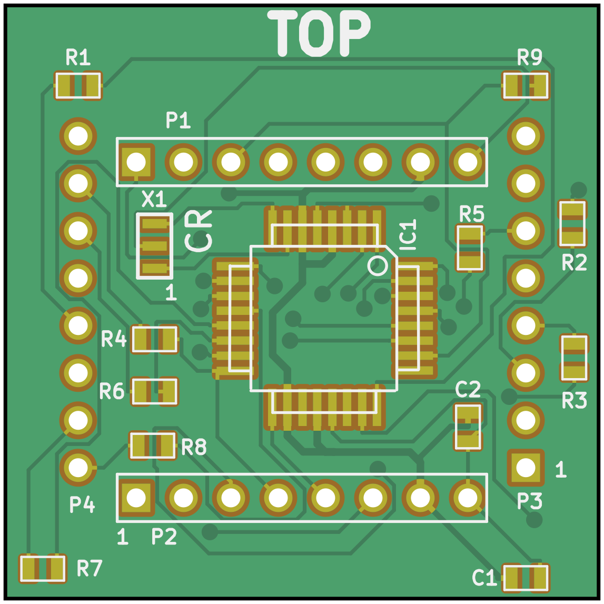
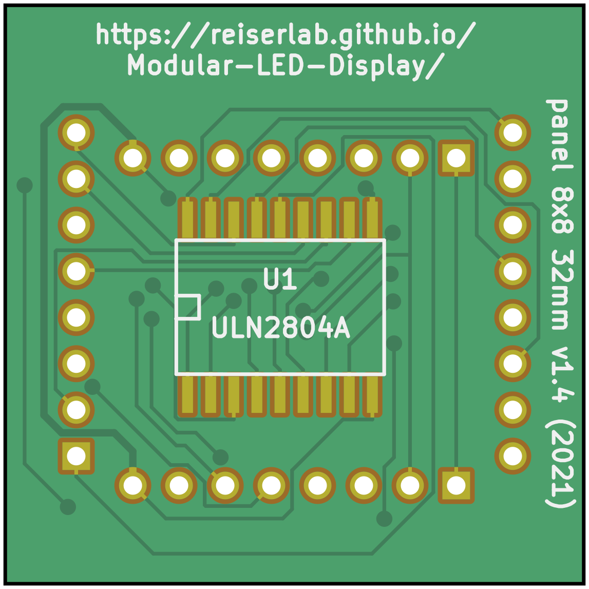

# Panel 8x8 32mm

{:.ifr .pop}
{:.ifr .pop .clear}

The display devices in [Generation 2 (G2)]({{site.baseurl}}/Generation%202/Arenas/docs/g2_system.html) and [Generation 3 (G3)]({{site.baseurl}}/Generation%203) of the Modular LED Display consists of a standard 8×8 LED matrix component mounted to a custom PCB. This custom PCB, in the original [paper](https://doi.org/10.1016/j.jneumeth.2007.07.019) and our [documentation]({{site.baseurl}}) referred to as the __panel__, is responsible for the communication with the controller. Each panel is individually addressed and communicates with the controller over the TWI bus. Each panel runs a small program which receives updated pattern information and refreshes the display.

__Note__: To clarify the terminology: in [Generation 4]({{site.baseurl}}/docs/g4_system.html) of the Modular LED Display, we built our own LED PCBs then referred to as [_driver_]({{site.baseurl}}/Generation%204/Panel/docs/driver.html), and the PCBs providing part of the panel board functionally being called [_comm board_]({{site.baseurl}}/Generation%204/Hardware/docs/comm.html).

## Components

The display devices are a small package that contains a panel board with a microprocessor and line driver, and an 8×8 LED dot matrix display. A brief overview of a [parts list](#parts-list) and the initial sketch of the [schematics](assets/panel_schematic_v2p1.pdf) and [board layout](assets/panel_pcb_v2p1.pdf) are archived here, but when in question always refer to the design and production files as they are more up to date. Each Panel contains an Atmel ATmega8 microcontroller. If you plan to program the Atmel chip, it is a good idea to read the ATmega8 spec sheet. The other chip on the circuit board is an 8-channel darlington driver which acts as a current sink. Current is sourced from the ATmega8's outputs and then passes through a current limiting resistor and one column of the 8×8 LED display. An individual LED is turned on only if the corresponding row line is enabled on the 8-channel current sink, allowing current to flow. In this way it is possible to scan the entire 8×8 array and thus 64 LEDs can be individually controlled with 16 lines. Of course, for this to happen no more than 1 row of LEDs can actually be on at any one time, and so the LEDs must be scanned quickly to prevent the perception of flicker. Currently the entire display is refreshed at 4kHz, and every LED that is on, is only on 12.5% of the time.

The LED matrix component [BM-10288MD](assets/datasheets/BM-10288MD.pdf) (or the alternative [BL-M12A811](assets/datasheets/BL-M12A881.pdf)) that was used in the Generation 2 displays measures 32×32mm² and consists of 8×8 = 64 LEDs. The panel board has the same dimension and is attached to the back of the matrix component. It contains an ATmega168-A and a ULN2804A to drive the LED matrix.

## Design and Production

The KiCad design files are in the `panel_8x8_32mm` directory. Gerber files and a Bill of Materials (BOM) are in a subdirectory `production_v1`. Data sheets for the components used in the built are archived in the `datasheets` directory. For historic reason and although completely outdated we also share the initial [cost estimation](assets/panel_8x8_32mm_costs.xls) done in 2011.

The most recent production of panels we are aware of was in 2020 (please [let us know]({{site.baseurl}}/Contact) if you built another batch). The [Frye lab](https://sites.lifesci.ucla.edu/ibp-frye/research/) used our files version 1.3 (generated in 2012) to order at [Bittele Electronics Inc](https://7pcb.com) in Canada. If you want to replicate the exact same order, feel free to include the order reference number Q12295E in your conversation with Bittele. The panels look a little different from the images above and used the name __flypanel__ internally. The exact same files used in this order are archived at `panel_8x8_32mm/production_v1/panel_8x8_32mm_v1p3.zip`.

The `panel_8x8_32mm/production_v1/panel_8x8_32mm_v1p4.zip` contains a more current, but untested update to the panel. If you are brave enough to order them and have experiences with it, then please get it [contact]({{site.baseurl}}/Contact).

## Software

__Note__: The following sections are out of date. Unless you need to repair a Generation 2 system, follow the instruction in the [Generation 3]({{site.baseurl}}/Generation%203/) menu.
{:.warning}

The software running on each Panel's ATmega8 microcontroller is written in C code, and compiled using the GCC tools for the AVR (WinAVR distribution). Packets are sent to each panel over the TWI bus, the TWI unit on the ATmega8 will only accept a packet if it is addressed either with a 0 (general call) or the address of the panel. In this way specific panels can be targeted. The EEPROM of the ATmega8 is loaded with some patterns, so that the SRAM on the chip is available for pattern buffers. The EEPROM contains the character library for 0…9 and the patterns for the error codes. The EEPROM also has one byte designated for the panel ID, this is set to 0 during the programming.

### Support for Gray Scale (Green Scale)

Multiple levels of //greenscale// patterns are supported by the panels. This is accomplished by further dividing the 4kHz refresh of the panels into either 3 or 7 pieces. When divided into 3 time segments, 4 greenscale levels are possible -- that is each LED can be on for 0, 1, 2, or 3 of the 3 possible time slices. Similarly, when divided into 7 time segments, 8 greenscale levels are possible - each LED can be on for 0,1,…,7 of the 7 total time slices. When measured with a photometer, this scheme is remarkably linear, e.g. the luminance measured for greenlevel 6 is almost exactly 3 times the luminance measured for greenlevel 2. This does reduce the minimum refresh rate to about 570Hz for the 7 levels (so-called `Gray_Scale = 7`), and to about 1333Hz for the 3 levels (so-called `Gray_Scale = 3`). The simplest implementation of this would use 7 copies of the 64-bit pattern map, each bit specifying whether each LED should be on during each time slice. However, we take advantage of binary decoding -- so we need twice the bits -- 16 bytes for each pattern frame at `Gray_Scale = 3`, and 24 bytes for each panels piece of a `Gray_Scale = 7` pattern. The actual way this is done is just a lot of messy, uninteresting boolean algebra. Please read the code if you are interested.

### Panel Address

The address of each panel can be any integer from 1…127. The 0 address is reserved for a general call -- all panels receive packets sent to address 0. The address displays when the panels turn on (and after a reset). Also immediately after a rest or power on, the panels enter a 0.5 second pause, and will be unresponsive to commands and patterns. Only two characters are shown (00…99), and if the value is above 100, the top row of the panel is also  illuminated. It is necessary to give the panels addresses in an incremental manner. If 5 panels, all with address 0 are connected to the controller, and a change address command is issued, all panels with the same address will respond. Read the user guide for instructions on addressing panels.

## Programming the Panels

Because each panel has a microprocessor on-board, each panel needs to be programmed individually. The programming interface (or ISP, in system programming) lines only connect to the microprocessor when the panel is in the left-most position of the controller board, or the plug on the case-mount portion of the controller PCB. The procedure described here is for programming G2 panels (the fuse setting are different for G3 panels). In some eventual future, programming will be done directly from the MATLAB interface. As of right now the procedure is as follows:

1. Once the panel is in place, connect the programming device to the 6 pin header, labelled __Panel ISP__.
2. Open AVR Studio and start the AVR programming tool *STK500/AVRISP*{:.gui-btn} from the tools menu.
3. Test the connection by selecting the ATmega8 device from the drop-down menu, and then in the advanced tab try to read signature. If these match, move on, otherwise check the connections, restart, etc.
4. Program the fuses. This is done from the *Fuses*{:.gui-btn} tab – these options should be set: *Preserve EEPROM memory through chip erase cycle*{:.gui-txt} to *on*{:.gui-txt}, and set clock rate to the last choice: *Ext. Crystal/Resonator High Freq.*{:.gui-txt}: *Start-up time 16K CK + 64 ms*{:.gui-txt}. It is also a good idea to set *Brown-out detection level at VCC*{:.gui-txt} = *4.0V*{:.gui-txt} and *Brown-out detection enabled*{:.gui-txt}.
5. Program the EEPROM on the Atmega8 by selecting the *Program*{:.gui-btn} tab and electing the input hex file as: *panel.eep*{:.gui-txt}, and then programming the chip.
6. Program the flash on the Atmega8 by selecting the *Program*{:.gui-btn} tab and selecting the input hex file as: *panel.hex*{:.gui-txt}, and then programming the chip.
7. If this is all done correctly the LED should display 00 and the display should be bright with no flicker. If it appears dull or flickery - the clock was probably not set correctly. It is always a good idea to verify both the program and the fuses to make sure these are set correctly.

For programming many panels this process can be automated by using the *Auto*{:.gui-btn} tab and selecting *program FLASH*{:.gui-txt}, *program EEPROM*{:.gui-txt}, and *program fuses*{:.gui-txt}. Once a panel is programmed it needs to be addressed, this is done using the PControl software.

# Parts list {#parts-list}

| quantity | part description               | source & p/n | price |
|---------:|:-------------------------------|:-------------|------:|
| 1        | 8×8 green [LED display]({{site.baseurl}}/Generation%203/Hardware/docs/assets/green-panels_BM-10288MD.pdf) | American Bright, BM-10288MI | $2.50 |
| 1        | 8 Pin rt angle male header              | Major League, LTSHR-108-S-02-A-T | $0.23 |
| 1        | 8 Pin rt angle fem. header              | Major League, SSHR-108-S-02-L-T | $0.38 |
| 8        | 82Ohm resistor, 1/10W, 1%, 0603 package | Digi-Key, 311-82.0HTR-ND | $0.005 |
| 1        | 1kOhm resistor, 1/10W, 5%, 0603 package | Digi-Key, 311-10KGCT-ND | $0.02 |
| 1        | 0.33µF capacitor, ceramic, 1206 package | Digi-Key, PCC1889CT-ND | $0.09 |
| 1        | 16MHz ceramic resonator w. capacitors   | Digi-Key, X908-ND | $0.30 |
| 1        | 8 CH line driver ULN2804A 8-SOL package | Digi-Key, ULN2804AFW-ND | $0.35 |
| 1        | [Atmega8](http://www.atmel.com/dyn/resources/prod_documents/doc2486.pdf) microcontroller, 32 TQFP package| Digi-Key, ATMEGA8-16AI-ND | $2.25 |
| 1        | Panel PCB                               | ordered from Advanced Circuits | |

__Optional__: 2 8-Pin straight female headers, Jameco p/n 70754 ($0.23), can be used so that the LED displays are socketed, this is convenient, but also will not guarantee ideal contact between circuit and display.
